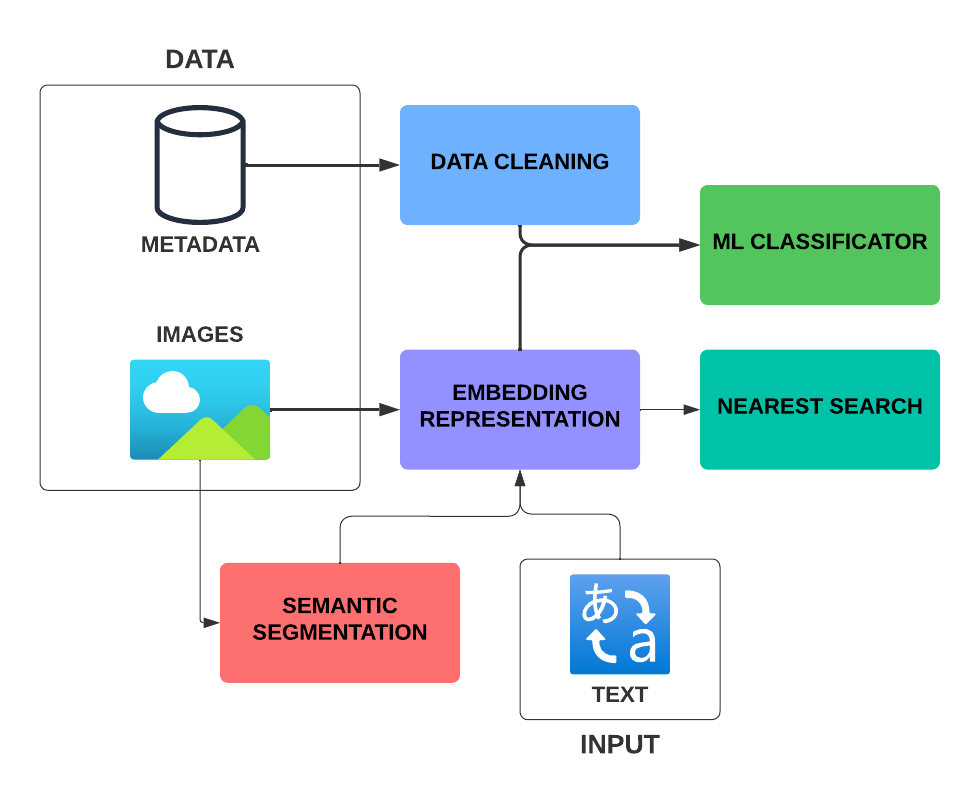

# Design Decoder
##### Bringing the future of Desing - DatathonFME2024 Winning project

Design Decoder is an AI tool with the purpose of making the life of designers easier.

## Introduction

In the fashion industry, accurately logging new garment samples into digital systems is a time-consuming task that requires meticulous attention to detail. This process involves creating a comprehensive product sheet with detailed information about each garment. Automating this process using machine learning (ML) and artificial intelligence (AI) can offer several key benefits:

- Frees up designers' time to focus on their core strength: designing garments, rather than manually entering product data.
- Ensures data quality and consistency for logged information.
- Seamlessly updates the product catalog with garment attributes that will ultimately appear on online stores.

## Overview

This project aims to create a model capable of determining the design attributes of a product given a product image and product metadata. The solution leverages the use of a Fashion-pretrained Model (CLIP) for creating the embeddings of the images, and the use of traditional AI models to classify the different products from the images and the data given.

## Objectives

* **Accuracy:** It is crucial that the accuracy of the model is the highest it can be to ensure that designers do not have to spend time correcting errors in the automatically generated product sheets. High accuracy will allow designers to trust the system and focus on their primary tasks, thereby increasing overall productivity and efficiency.

* **Fast Inference Time:** The model should be able to process and classify images quickly to ensure that the system can keep up with the pace of new garment samples being created. This will help in maintaining a smooth workflow without delays.

* **Scalability:** The solution should be scalable to handle a large number of images and metadata entries as the product catalog grows. It should be able to maintain performance and accuracy even with an increasing volume of data.

* **User-Friendly Interface:** The tool should have an intuitive and easy-to-use interface for designers and other users. This includes clear visualizations and straightforward interaction mechanisms to ensure that users can efficiently utilize the tool without extensive training.

* **Robustness:** The model should be robust enough to handle variations in image quality, lighting conditions, and different styles of garments. It should be able to reliably handle images of both clothes and models with clothes on, and generalize well across different types of products and scenarios. It is important that both types of images are correctly labeled to ensure the accuracy and reliability of the system.

## Technical Stack

Our application leverages a combination of modern machine learning frameworks and tools to deliver a seamless and efficient experience:

- *PyTorch*: Used for deep learning tasks, including the integration of CLIP for powerful image-text embeddings.
- *XGBoost*: Implements gradient boosting algorithms for efficient and scalable model training.
- *OpenCV*: Handles advanced image processing tasks, enabling effective visual data manipulation.
- *Streamlit*: Powers the web interface, providing an intuitive and interactive user experience.
- *NumPy & Pandas*: Essential for efficient data manipulation, handling, and analysis.
- *Scikit-learn*: Used for preprocessing and feature engineering, ensuring data is well-prepared for modeling.

## How did we use it

We performed exploratory data analysis in the `EDA` notebook.
We used the python notebook `model_v1` to generate the embedings of the images.
Then, we used multipler other python notebooks (such as `main_inference`) to try out different methods of predicting the test values. 
